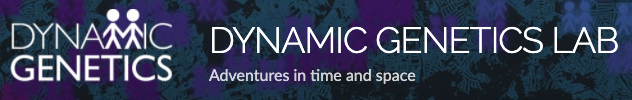

# Deep Learning for Health and Life Sciences with 

This workshop has been presented at the [**Data Week Online 2020**](http://www.bristol.ac.uk/golding/get-involved/data-week-online-2020/) organised by the [**Jean Golding Insitute**](http://www.bristol.ac.uk/golding/) 

The introductory deck of slides to this tutorial is available on my [SpeakerDeck](https://speakerdeck.com/leriomaggio/) profile: 

[Deep Learning for the Health and Life Sciences with PyTorch](https://speakerdeck.com/leriomaggio/deep-learning-for-health-and-life-sciences-with-pytorch). 

The **full abstract** of the workshop is available here: [Abstract](./abstract.md)

### Content at a glance

* Introduction to ML and DL for the Health and Life Science
	- Short introduction to PyTorch

* Reproducibility and Replicability
	- Replication Case study on Heart Failure

* BioImages
	- Diabetic Retinopathy from fundus images
	- Histopathological Images and Transfer Learning

* Few Notes on Model Interpretability

### Technical Requirements

This tutorial runs on ***\*Python 3\**** (Py3.4+ should be fine), and requires the following main packages:

- `numpy`
- `scipy`
- `matplotlib`
- `scikit-learn`
- `torch` (of course 😄)
- `torchvision`

The complete list of requirements is available in [`requirements.txt`](./requirements.txt)

Detailed (**step-by-step**) instructions to setup the Python virtual environment on your local machine are also available [here](./setup.md).

If you don't want to bother setting up everything on your local computer (__and also have a pretty good internet connection_) you might also consider the following two alternatives:

#### MyBinder

#### Google Colab

### License Summary

The material provided in this repository adopts two different licence files, for Lecture notes and Source Code, respectively. 

The Lecture notes (and corresponding source notebooks) are available under the **Creative Commons Attribution-ShareAlike 4.0 International License**. 
See the `LICENSE` file.

The samples and reference code within this repository is made available under the **GNU GPL v3**. See the `LICENSE-CODE` file.

#### References

**Author**: Valerio Maggio, **Senior Research Associate** `@` Dynamic Genetics Lab 

| **Contacts** |
| ------------ |
|   [`@leriomaggio`](http://twitter.com/leriomaggio) |
|        [`ValerioMaggio`](http://it.linkedin.com/in/valeriomaggio)       |
|        [`valerio.maggio@bristol.ac.uk`](valerio.maggio@bristol.ac.uk)         |